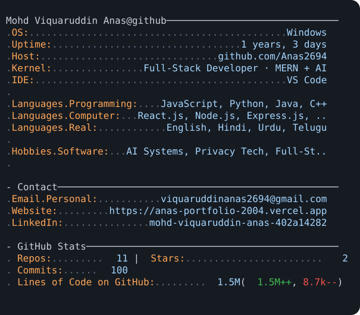

  

## About me

I'm a full-stack developer who builds production-ready, cloud-deployed applications. I work across responsive interfaces, scalable backends, multi-tenant architecture, APIs, databases, integrations, and deployment—turning practical ideas into useful products.

  
  <picture>
    <source media="(prefers-color-scheme: dark)" srcset="./assets/githubwallpaper-dark.svg" />
    <source media="(prefers-color-scheme: light)" srcset="./assets/githubwallpaper-light.svg" />
    
  </picture>

## Featured projects

| Project | What it does | Links |
| --- | --- | --- |
| **PostVisit** | Turns medical reports into understandable health insights, trends, and contextual chat. | [Live](https://postvisit-healthcare.onrender.com) · [Code](https://github.com/Anas2694/PostVisit-healthcare) |
| **ExitLens** | Tracks user behavior and converts sessions into actionable UX insights. | [Live](https://exitlens-app.onrender.com) · [Code](https://github.com/Anas2694/ExitLens) |
| **UrbanStay** | Full-stack vacation-rental platform with listings, bookings, maps, reviews, and email notifications. | [Live](https://urbanstay-81ly.onrender.com) · [Code](https://github.com/Anas2694/UrbanStay) |
| **OwnTrace** · _In active development_ | Personal digital-identity and privacy-control platform with account discovery and breach checks. | [Code](https://github.com/Anas2694/owntrace) |

## Skills and stack

  

- **Frontend:** React, HTML, CSS, JavaScript, EJS, Bootstrap, responsive UI
- **Backend:** Node.js, Express, REST APIs, authentication, multi-tenant architecture
- **Data:** MongoDB, Mongoose, SQLite, SQL, data-processing pipelines
- **Cloud and tools:** Google Cloud, Docker, Git, GitHub, Postman, VS Code, Render, Vercel

## GitHub activity

<picture>
  <source media="(prefers-color-scheme: dark)" srcset="https://raw.githubusercontent.com/Anas2694/Anas2694/output/github-contribution-grid-snake-dark.svg" />
  <source media="(prefers-color-scheme: light)" srcset="https://raw.githubusercontent.com/Anas2694/Anas2694/output/github-contribution-grid-snake.svg" />
  
</picture>

## Connect

  
  
  
  

